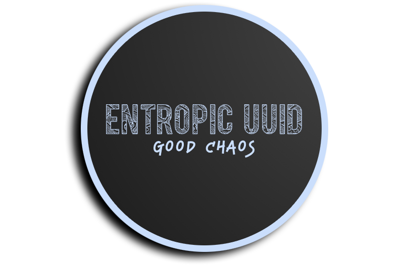

<a name="readme-top"></a>

[![Stargazers][stars-shield]][stars-url]
[![Issues][issues-shield]][issues-url]

<br />
<div align="center">
  <a href="https://github.com/jessewarren-aa/entropic-uuid">
    
  </a>

<h3 align="center">Entropic UUID</h3>

  <p align="center">
    Generate word-based UUIDs<br />
    Currently uses the 3,000 most common English words, so... no promises for the content
    <br />
    <a href="https://github.com/jessewarren-aa/entropic-uuid">View Demo (coming soon)</a>
    ·
    <a href="https://github.com/jessewarren-aa/entropic-uuid/issues">Report Bug</a>
  </p>
</div>

### Prerequisites

  ```sh
  npm install npm@latest -g
  ```

### Installation

   ```sh
   npm install entropic-uuid
   ```

   ```js
   import generateUUID from "entropic-uuid"
   ```

<p align="right">(<a href="#readme-top">back to top</a>)</p>

<!-- USAGE EXAMPLES -->
## Usage

  * Generate UUID
  ```js
  import generateUUID from "entropic-uuid"
  
  // default UUID length is 4
  const defaultUUID = generateUUID();
  // 'etc-ignore-field-invite'
  
  const customLengthUUID = generateUUID(7);
  // 'criticism-mental-practical-thing-member-architect-promote'
  
  ```

<p align="right">(<a href="#readme-top">back to top</a>)</p>

[stars-shield]: https://img.shields.io/github/stars/jessewarren-aa/entropic-uuid.svg?style=for-the-badge
[stars-url]: https://github.com/jessewarren-aa/entropic-uuid/stargazers
[issues-shield]: https://img.shields.io/github/issues/jessewarren-aa/entropic-uuid.svg?style=for-the-badge
[issues-url]: https://github.com/jessewarren-aa/entropic-uuid/issues
